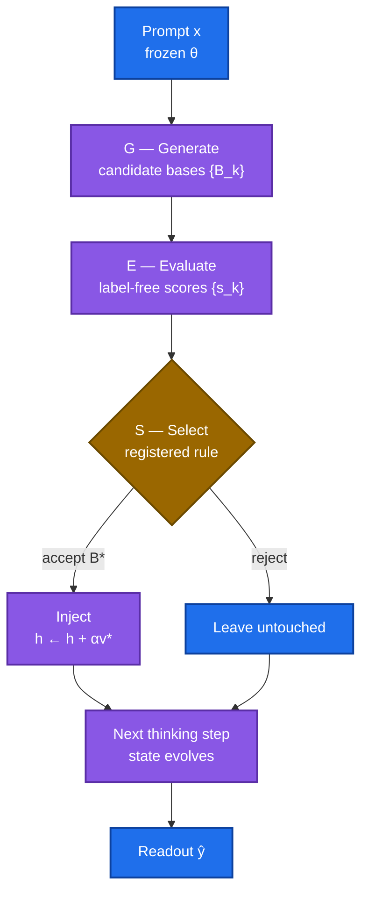
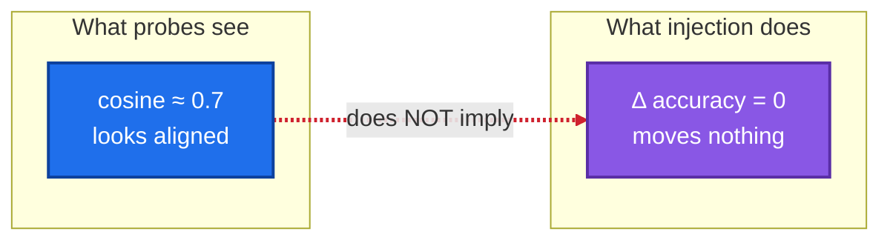
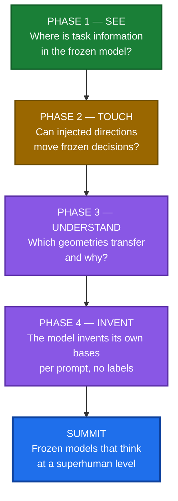

# Self-Consistent Basis Invention (SCBI)

**The research program to make frozen language models superhuman thinkers — new intelligence from inference-time computation alone, without ever changing a weight.**

*This README is the lab's definitive account: the paradigm shift, the formal science, the implementation, the complete experimental record, and the structured road to the summit.*

---

# Part I — The paradigm shift

## 1. How LLMs work today

Every large language model follows one paradigm: **train** (months of compute bake intelligence into weights $\theta$) → **freeze** ($\theta$ locked) → **deploy** (prompt in, answer out). In this paradigm, **intelligence = weights**. A deployed model can never become smarter than the day it was frozen — every capability gain demands another training run at ~10× the cost.


## 2. Why the paradigm must change

- **Economic:** frontier runs cost hundreds of millions of dollars, ~10× per generation.
- **Data:** high-quality human text is finite.
- **Conceptual — the deepest ceiling:** the model is *passive* at inference. It cannot notice its own confusion, construct a better internal representation, or think harder in a new way. The thinking is frozen along with the weights.

## 3. The SCBI shift — intelligence as a process

SCBI separates what the field fused: **knowledge** (weights, fixed) from **thinking** (inference-time computation, free to grow).

| | Today's paradigm | SCBI |
|---|---|---|
| Knowledge lives in | weights $\theta$ (training) | weights $\theta$ (training) |
| Thinking happens in | one frozen forward pass | an active inference loop |
| Model at inference | passive | reads its own activations, invents representations, selects the best |
| Getting smarter needs | retraining ($$$) | more inference compute (cheap) |
| Intelligence = | the weights | weights × thinking |

Formally, capability is $C(\theta, T)$ — weights $\theta$, inference-time budget $T$. The field grows $\theta$. **We fix $\theta = \theta_0$ and grow $T$.** The question: how much intelligence is latent in frozen weights, unlockable by better thinking alone?

---

# Part II — The science

## 4. The formal objective (adopted LOG-142)

$$\boxed{\theta_{\text{after}} = \theta_{\text{before}}}$$

while temporary computational state evolves during inference:

$$(B_t, z_t, C_t, M_t, \ldots) \;\to\; (B_{t+1}, z_{t+1}, C_{t+1}, M_{t+1}, \ldots)$$

$B_t$ = the active representational basis at step $t$; $z_t$ = the transient latent state; $C_t$ = candidate bases under evaluation; $M_t$ = selection memory. The bar is **mechanism-level (P1)**: qualitatively new computation, not a better benchmark score. The organizing question: *what discovery would have to be true for a frozen model to become far more cognitively capable through inference-time computation?*

## 5. The canonical loop — Generate, Evaluate, Select

$$(\theta, x) \;\to\; G \;\to\; \{B_k\} \;\to\; E \;\to\; \{s_k\} \;\to\; S \;\to\; B^* \;\to\; \text{Readout} \;\to\; \hat{y}$$

- **G (Generate):** propose $k$ candidate temporary bases $\{B_k\}$ from the current activations.
- **E (Evaluate):** score each candidate $\{s_k\}$ — label-free, at inference time.
- **S (Select):** a registered selection rule picks $B^*$; only then is it injected.
- **Readout:** the frozen model decodes with $B^*$ in its residual stream.



The hard problem — the actual research — is G/E/S: **how does a model invent the right representation for a thought it hasn't finished thinking, without labels?** That is *basis invention*, and it separates SCBI from steering-vector methods that hand the model a precomputed direction.

## 6. The mathematics, carefully

**The frozen constraint.** $\theta_t = \theta_0$, $\Delta\theta \equiv 0$ — every parameter byte-identical before/after, hash-verified on every run. Rules out fine-tuning, adapters, and unreversed "temporary" updates.

**The workspace.** The residual stream $h \in \mathbb{R}^d$ ($d = 1024$ for Pythia-410m) at each layer and token — the model's working memory. SCBI operates here: not on weights, not on tokens, but on the geometry of thought.

**The intervention operator.** $h' = h + \alpha v$, $\lVert v\rVert = 1$: nudge mid-thought activations along direction $v$ with strength $\alpha$. Every causal claim faces its **placebo** $-v$: if $+v$ and $-v$ move decisions equally, it's generic perturbation, not information — claim dead.

**The core distinction — decodability ≠ causality.**



A probe reading information from activations (decodability) does not mean the model uses it (causality). Established across the program: ~0.7 cross-vocabulary cosine similarity with exactly zero causal transfer under static injection.

**Statistical certification.** 1-NN leave-one-out probe (60 items, 20 labels, 5% chance) → permutation test (~1000 shuffles; $p$ = fraction beating the real score; $q_{95}$ = luck ceiling; effect = accuracy − $q_{95}$) → Bonferroni over 24 layers ($0.05/24 \approx 0.00208$) → machine-checked guards (e.g. injection fidelity $\frac{\lVert r_{\text{hooked}} - (r_{\text{clean}} + \alpha v)\rVert}{\lVert \alpha v\rVert} \le 10^{-6}$; a failed guard voids the run — RUN-INVALID, never a false result) → pre-registered KILL/CONTINUE/PIVOT bars, so verdicts are mechanical.

---

# Part III — The implementation

The `scbi/` package is the frozen-backbone runtime:

```text
scbi/
├── core/
│   ├── frozen_model.py   # FrozenModelWrapper — read-only weight access, hash verification
│   ├── basis.py          # SubspaceProjector, generate_candidate_subspaces — the G step
│   └── engine.py         # SCBIEngine — the full G → E → S → Readout loop
├── representations/      # Activation readers, residual-stream access
├── generators/           # Candidate construction strategies
├── optimization/         # Label-free scoring objectives
├── state/                # Transient inference-time state (B_t, z_t, C_t, M_t)
├── baselines/            # Comparison methods
└── models/               # Model adapters (Pythia, CLM-8B, …)
```

`SCBIEngine` executes $(\theta, x) \to G \to \{B_k\} \to E \to \{s_k\} \to S \to B^* \to \text{Readout} \to \hat{y}$ with verified parameter immutability. `evaluation/` holds metrics, statistical tests, ablations, and failure analysis; `theory/` holds the full mathematical specification (definitions, assumptions, formulation, algorithm, complexity, proofs).

---

# Part IV — The experimental program

## 7. Two eras

**Era 1 — EXP001–EXP066: the static-injection era.** Dozens of experiments testing whether precomputed geometric directions (concept vectors, cones, offsets, cross-vocabulary alignments) could steer frozen models. The era's conclusion is the program's most important result: **the representational–causal dissociation** — geometry that looks meaningful transfers nothing. The era ended by killing its own paradigm.

**Era 2 — EXP067 onward: the adaptive-loop era.** The G/E/S loop, pre-registered protocols, independent review, boundary science. The question moved from "which direction works?" to "can the model invent directions?" — from static geometry to inference-time cognition.

## 8. Experiment registry (79 run directories, 97 protocols, 9 signed)

| Experiment | Question | Verdict |
|---|---|---|
| EXP065/066 | Does ~0.7 cross-vocab similarity transfer causally? | **Boundary:** similarity without transfer (replicated 160M→410M) |
| EXP077 | Does any static geometric variant move decisions? | **(c) NEITHER** — ΔM=0, p=1.0; bridge control +10pp (56.67%→66.67%, p=0.03125) |
| EXP079 | HALT probe for the adaptive loop | **HALT** accepted via CPU readiness computation |
| EXP082 | Foil-suppression tilt | **KILL** upheld |
| EXP091 | Layer-20 cosine readout | **KILL** — 31/60 = 51.67%, p = 0.449 |
| EXP092 | Information-bottleneck localization (all 24 layers) | **CONTINUE** — layer 11: 33.3% vs 5% chance, p = 0.000999, +20pp over null |
| EXP093 | Layer-11 causal transfer (±v + placebo) | In review — G5 probe defect found, repaired (4.3e-07 ≤ 1e-6), re-verification running |
| G1 | QK/OV null-space mechanism audit | **KILL** — theorem false as stated (inverted QK-visibility) |
| K1 | Readout-tilt falsification | Null — 0/180 reached the 0.9 bar |
| K2 → EXP083 → EXP084 → EXP086-B → EXP088 | GPU queue (relational amplification, Newton duel, dynamical amplifier, recirculation) | Signed, queued on free-tier hardware |

The complete record — 250+ LOG entries, every kill, halt, retraction, and RUN-INVALID preserved — is `reports/research_log.md`.

## 9. Key results, exactly as licensed

**Finding 1 — the dissociation.** ~0.7 cosine similarity, zero causal transfer. Replicated. *Decodability is not influence.*

**Finding 2 — localization.** Frozen Pythia-410m layer 11 carries significant task information: 33.33% (20/60) vs 5% chance, permutation $p = 0.000999$ < Bonferroni $0.00208$, +20pp above the null ceiling. Eight layers significant: {1, 11–15, 17, 18}. Layer 20 — previously inspected — correctly excluded (15%, p ≈ 0.066). Caveat: phrasing-sensitive (A-first 53.3% vs C-first 13.3%).

**Finding 3 — falsified mechanisms.** Static cones, layer-20 readouts, and the QK null-space theorem are dead — preserved as permanent "do not dig here" markers.

**Novelty position: N1 (Known Combination).** The tested static mechanism is operator-equivalent to prior art. The program's one genuine lead is boundary science — and the one axis where nobody, including the frontier, has a result: **label-free autonomous steering**. That is the race.

---

# Part V — The road to superhuman



**Phase 1 — SEE (established).** Layer-11 localization. *Unlocks: we know where to intervene.*

**Phase 2 — TOUCH (decisive test).** Inject the layer-11 direction with sign-flip placebo. KILL is the registered prior; CONTINUE would prove label-informed steerability. *Unlocks: proof that frozen decisions can be steered by discovered directions.*

**Phase 3 — UNDERSTAND (mechanism).** The transfer operator: which geometries move decisions and why. *Unlocks: a predictive theory of what to inject.*

**Phase 4 — INVENT (autonomy).** The full G/E/S loop running on its own — per prompt, no labels, no human. *Unlocks the summit: frozen models that think at a superhuman level, improving every prompt by thinking better, with zero retraining.*

Each phase is gated by pre-registered statistics and binding independent review. A failed phase is a result — it tells us exactly where the theory breaks.

---

# Part VI — How this changes the AI industry

- 🔄 **Economics flip.** Capability without retraining — reasoning upgrades ship as software, not $100M training runs.
- 👤 **Personalization without fine-tuning.** Per user, per task, at inference time.
- ⚡ **Compute shifts.** The scaling axis moves from training clusters to inference — months of datacenter time to seconds per prompt.
- 🔒 **Safety.** Frozen weights are auditable: fixed artifact, inspectable thinking loop.
- 🔬 **Science.** What trained models *contain* versus what they can *express* — the deepest open question about today's LLMs.

---

# Part VII — The honest scoreboard

We track SCBI against the industry frontier on the same axes (`research/benchmarks/FRONTIER_SCOREBOARD.md`). The frontier holds verified numbers — ∇-Reasoner 80.4% on MATH-500, Meta-Reasoner +9–12% at −28–35% inference time, LatentMAS +14.6%, ToT 4%→74%, Self-consistency +17.9pp, ITI +32.6pp. **SCBI holds zero capability entries.** Our lead is boundary science, and the only axis where the frontier is also at zero — label-free autonomous steering — is the one race we can still win. The board says so openly; beating it requires powered N≈100+ evidence, an order of magnitude beyond anything produced to date.

---

# Part VIII — How the lab works

**Independent review with teeth.** The reviewer reports to the founder, not the CEO; verdicts are binding and cannot be overridden. Reviews recompute statistics from primary artifacts — twice catching degenerate mathematics before a flop was spent.

**The 14 agent laws** (`AGENTS.md`): read before modifying; never invent results; never fabricate citations; never silently shift hypotheses or definitions; preserve the frozen backbone; zero data leakage; never delete failed experiments; no post-hoc cherry-picking; never claim premature novelty; observation ≠ interpretation; document major decisions; preserve reproducibility; challenge rather than defend.

**The worth-it gate (Law #15):** precise question → the KILL/CONTINUE/PIVOT decision it changes → the cheapest falsifying test and its cost → the mathematical license with a quantitative prediction and a breaking point. No license, no work.

**Launch chain:** pre-registration → Law #14 review (SIGN/SIGN-WITH-FIXES/REJECT) → bundle build + smoke test → CEO execution clearance → guarded execution (Δθ=0) → independent verdict review → LOG entry. **Signed protocols are immutable** — corrections via append-only errata or a new experiment number, never silent edits, never force-pushes.

---

## Repository map

```text
SCBI/
├── theory/                  # Definitions, assumptions, formulation, algorithm,
│                            # complexity, proofs — the mathematical specification
├── research/
│   ├── benchmarks/           # Frontier scoreboard (SCBI vs 6+ industry systems)
│   ├── synthesis/            # Adopted program syntheses (REV2)
│   ├── literature/           # Prior-art verification (24 records, N1 verdict)
│   ├── innovation/           # Ambition sprints, paradigm audits, proposals
│   ├── hypotheses/           # Registered hypotheses (H001, H002, …)
│   ├── GIT_WORKFLOW.md       # Lab git discipline
│   └── CAMPAIGN_30DAY.md     # Campaign charter
├── experiments/
│   ├── protocols/            # 97 pre-registrations (9 SIGNED — immutable)
│   │   ├── REVIEWS/          # Binding independent reviews
│   │   └── ERRATUM_*.md      # Append-only corrections
│   └── runs/                # 79 run directories: bundle + report + artifacts
├── evaluation/              # Metrics, statistical tests, ablations, failure analysis
├── reports/
│   ├── research_log.md      # 250+ LOG entries — every verdict preserved
│   └── paper_draft.md       # Boundary/negative-result workshop paper
├── scbi/                    # Implementation: frozen runtime, G/E/S engine, guards
├── scripts/  tests/         # Tooling and test suites
├── TECHNICAL_STACK.md       # Free-tier compute, reproducibility standard
├── MUSE_HANDOVER_PROMPT.md  # Machine-readable program handover
└── AGENTS.md                # The 14 agent laws
```

**Source-of-truth hierarchy:** `theory/README_DEFINITIONS.md` → `theory/README.md` → `theory/README_ASSUMPTIONS.md` → `research/README_LITERATURE.md` → `theory/README_ALGORITHM.md` → `scbi/README.md` → `experiments/README.md` → `evaluation/README.md` → `reports/README.md`. Primary artifacts outrank summaries; the research log outranks this README.

## Glossary

| Term | Meaning |
|---|---|
| **Frozen backbone** | Weights never change (Δθ ≡ 0, hash-verified). |
| **Residual stream** | The model's working memory, $h \in \mathbb{R}^d$. |
| **G / E / S** | Generate candidates → Evaluate (label-free) → Select (registered rule). |
| **Basis invention** | The model inventing task-specific representations at inference time. |
| **Intervention** | $h' = h + \alpha v$ — nudging activations mid-thought. |
| **Placebo** | Sign-flipped $-v$; kills generic-perturbation artifacts. |
| **Decodability** | Probe reads info from activations. Correlational. |
| **Causality** | Injection moves decisions. The bar that matters. |
| **Pre-registration** | Question, bars, budget written before execution. |
| **Signed protocol** | Reviewed, immutable; corrections via errata only. |
| **Guard** | Machine-checked invariant; failed guard voids the run. |
| **Bridge** | Known-answer positive control for the injection machinery. |
| **KILL / CONTINUE / PIVOT / HALT / RUN-INVALID** | The five verdicts. A KILL is a result. |

## Reproducing

CPU-first, $0$: pinned seeds, environment manifests, hash-verified frozen weights, raw instance logs. Each run directory is self-contained (bundle + build notes + report). GPU benches run on free-tier hardware via tested notebooks.

## Contributing

Lab discipline: topic branches, PRs for everything, review before merge, never force-push, never commit secrets or weights.

## License

Apache-2.0 — see `LICENSE`.

## Citation

> SCBI Research Program, *Self-Consistent Basis Invention: inference-time intelligence in frozen models*, GitHub repository, 2026.
