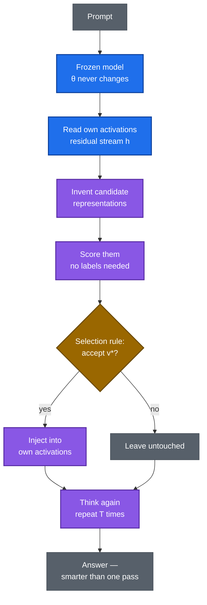
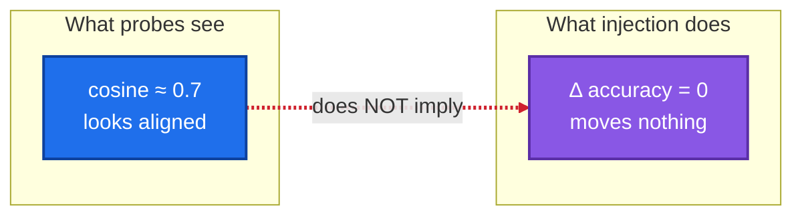
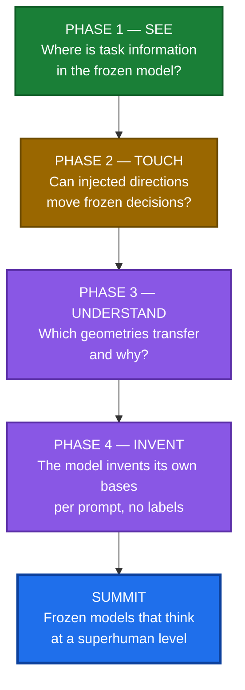

# Self-Consistent Basis Invention (SCBI)

**How frozen language models become superhuman thinkers — new intelligence from inference-time computation alone, without ever changing a weight.**

---

## 1. How LLMs work today

Every large language model you use follows the same paradigm:

1. **Train** — months of compute bake intelligence into the weights $\theta$.
2. **Freeze** — the weights are locked.
3. **Deploy** — the model answers prompts, but it can never become smarter than the day it was frozen.

In this paradigm, **intelligence = weights**. A deployed model cannot learn, cannot improve its own thinking, cannot invent a better way to reason about your prompt. Every capability gain demands another training run — hundreds of millions of dollars, more data, more energy.


## 2. The ceiling of today's paradigm

- **Economic:** each generation costs ~10× the last. This cannot continue indefinitely.
- **Data:** high-quality human text is finite; the field is approaching the wall.
- **Conceptual — the deepest one:** the model is *passive* at inference. All of its cognitive machinery was fixed during training. It cannot notice its own confusion, construct a better internal representation, or think harder in a new way. The thinking is frozen along with the weights.

## 3. The SCBI shift — intelligence as a process, not just weights

SCBI separates two things the field has fused together:

| | Today's paradigm | SCBI |
|---|---|---|
| **Knowledge** lives in | weights $\theta$ (fixed at train time) | weights $\theta$ (fixed at train time) |
| **Thinking** happens in | one frozen forward pass | an *active inference loop* |
| Model at inference | passive: prompt in, answer out | active: reads its own activations, invents representations, selects the best |
| Getting smarter requires | retraining ($$$) | more inference-time compute (cheap) |
| Intelligence = | the weights | weights × thinking |

The bet, stated formally: capability is $C(\theta, T)$ — weights $\theta$, inference-time compute $T$. The field maximizes $C$ by growing $\theta$. **We fix $\theta = \theta_0$ and grow $T$** — asking how much intelligence is latent in frozen weights, unlockable by better thinking alone.

If $\frac{\partial C}{\partial T} > 0$ in a general way, the industry flips: capability upgrades ship as software, models personalize without fine-tuning, and frozen weights stay fully auditable.

## 4. How it works

### The frozen constraint

$$\boxed{\theta_t = \theta_0 \qquad \Delta\theta \equiv 0}$$

Every parameter — weights, biases, norms — is byte-identical before and after. Hash-verified on every run. Nothing learns, ever.

### The workspace of thought

At layer $l$, the model's working memory is the **residual stream** $h \in \mathbb{R}^d$ ($d = 1024$ for Pythia-410m). Everything the model "holds in mind" mid-computation lives in these vectors. SCBI operates here — not on weights, not on tokens, but on the geometry of thought itself.

### The intervention operator

$$h' = h + \alpha v, \qquad \lVert v \rVert = 1$$

Reach into mid-thought activations, nudge them along direction $v$ with strength $\alpha$, observe whether the decision changes. Every causal claim is tested against its **placebo** $-v$ (sign flip): if $+v$ and $-v$ work equally, it's generic perturbation, not information — claim dead.

### The algorithm — the thinking loop

```text
SCBI-Inference(prompt x, frozen model M_θ, budget T):
    h ← M_θ.encode(x)                      # frozen forward pass
    repeat T times:                        # the model thinks
        C ← ConstructCandidates(h)         # propose temporary representations
        s ← Score(C)                       # evaluate, no labels
        v* ← Select(C, s)                  # choose the best basis
        if Accept(v*):
            h ← h + αv*                    # inject into its own activations
    return M_θ.decode(h)
```



The hard problem — the actual research — is the middle three boxes: **how does a model invent the right representation for a thought it hasn't finished thinking, without labels?** That is "basis invention," and it is what separates SCBI from steering-vector methods that hand the model a precomputed direction.

### The core distinction



**Decodability ≠ causality.** A probe can read information from activations without the model *using* it. Established: ~0.7 cross-vocabulary similarity with zero causal transfer. Every SCBI claim must cross the causal bar — move the frozen model's decisions, or it doesn't count.

---

## 5. The road to superhuman — the structured plan

Four phases. Each proves one thing and unlocks the next. No phase is skipped; no claim outruns its phase.



**Phase 1 — SEE (established).** Map where task information lives. Result: it peaks mid-network — layer 11 of frozen Pythia-410m reads 33.3% where chance is 5% ($p = 0.000999$, Bonferroni-significant). The previously inspected layer 20 was correctly excluded. *Unlocks:* we know where to intervene.

**Phase 2 — TOUCH (the decisive test).** Inject the layer-11 direction ($\pm v$ with sign-flip placebo) and measure whether frozen decisions move. KILL is the expected outcome — the directions are only ~3% coherent — but a CONTINUE would prove label-informed steerability is real. *Unlocks:* proof that frozen decisions can be steered by discovered directions.

**Phase 3 — UNDERSTAND (mechanism).** Characterize the transfer operator: which geometries move decisions and why. Falsified so far: static cones, layer-20 readouts, the QK null-space story. *Unlocks:* a predictive theory of what to inject.

**Phase 4 — INVENT (autonomy).** The model proposes, scores, and selects its own bases at inference time — per prompt, no labels, no human in the loop. This is the full algorithm of §4 running on its own. *Unlocks:* **the summit — frozen models that think at a superhuman level**, improving every prompt by thinking better, with zero retraining.

Each phase is gated by pre-registered statistics and independent review. A phase that fails is a result, not a setback — it tells us exactly where the theory breaks.

## 6. How this changes the AI industry

When Phase 4 lands — and each phase is designed to make the next cheaper to test — the consequences are structural:

- 🔄 **Economics flip.** Capability without retraining: ship reasoning upgrades as software, not $100M training runs.
- 👤 **Personalization without fine-tuning.** Adapt per user, per task, at inference time.
- ⚡ **Compute shifts.** The scaling axis moves from training clusters to inference — from months of datacenter time to seconds per prompt.
- 🔒 **Safety.** A frozen model is auditable: fixed weights, inspectable thinking loop, no moving target.
- 🔬 **Science.** We finally learn what trained models *contain* versus what they can *express* — the deepest open question about today's LLMs.

## 7. Benchmarks — proof, not promises

| Bench | What it measures | Method |
|---|---|---|
| **Localization** | Where task information lives | 1-NN probe across all layers; permutation test + Bonferroni |
| **Causal transfer** | Whether injection moves decisions | $\pm v$ with sign-flip placebo; accuracy delta |
| **Geometry** | Which shapes transfer | Cones, offsets, relational directions vs controls |
| **Guards** | Whether the apparatus worked | Δθ = 0 hashes; injection fidelity ≤ 10⁻⁶ |
| **Frontier scoreboard** | SCBI vs the field | 6 industry inference-time systems (`research/benchmarks/`) |

CPU-first at $0; GPU benches on free-tier hardware with tested, independently signed bundles. Every bench pre-registers its bars; verdicts (KILL / CONTINUE / PIVOT) are mechanical.

---

## Scientific foundations

- **The dissociation:** ~0.7 cosine similarity, zero causal transfer — replicated across scale. Decodability is not influence.
- **Localization:** layer-11 peak, 33.3% vs 5% chance, $p = 0.000999$.
- **Falsified:** layer-20 readouts, static cone geometry, QK null-space mechanism — preserved as permanent "do not dig here" markers.

## Repository map

```text
SCBI/
├── theory/                  # Definitions, assumptions, formulation, proofs
├── research/
│   ├── benchmarks/           # Frontier scoreboard
│   ├── synthesis/            # Adopted program syntheses (REV2)
│   ├── GIT_WORKFLOW.md       # Lab git discipline
│   └── CAMPAIGN_30DAY.md     # Campaign charter
├── experiments/
│   ├── protocols/            # Pre-registrations (immutable once signed)
│   │   └── REVIEWS/          # Binding independent reviews
│   └── runs/                # 70+ run directories: bundle + report + artifacts
├── evaluation/              # Metrics, statistical tests, ablations
├── reports/
│   ├── research_log.md      # Append-only record of every verdict
│   └── paper_draft.md       # Boundary/negative-result workshop paper
├── scbi/                    # Frozen-backbone runtime, guards
├── TECHNICAL_STACK.md       # Free-tier compute, reproducibility standard
└── AGENTS.md                # The 14 agent laws
```

## Glossary

| Term | Meaning |
|---|---|
| **Frozen backbone** | Weights never change (Δθ ≡ 0, hash-verified). |
| **Residual stream** | The model's working memory, $h \in \mathbb{R}^d$. Where SCBI operates. |
| **Intervention** | $h' = h + \alpha v$ — nudging activations mid-thought. |
| **Placebo** | Sign-flipped $-v$; kills generic-perturbation artifacts. |
| **Decodability** | Probe reads info from activations. Correlational. |
| **Causality** | Injection moves decisions. The bar that matters. |
| **Basis invention** | The model inventing its own task-specific representations at inference time. |
| **Pre-registration** | Question, bars, and budget written before execution. |
| **Guard** | Machine-checked invariant; failed guard voids the run. |

## Reproducing

CPU-first, $0$: pinned seeds, environment manifests, hash-verified frozen weights. Each run directory is self-contained.

## Contributing

Topic branches, PRs for everything, review before merge, never force-push, never commit secrets or weights (`research/GIT_WORKFLOW.md`).

## License

Apache-2.0 — see `LICENSE`.

## Citation

> SCBI Research Program, *Self-Consistent Basis Invention: inference-time intelligence in frozen models*, GitHub repository, 2026.
