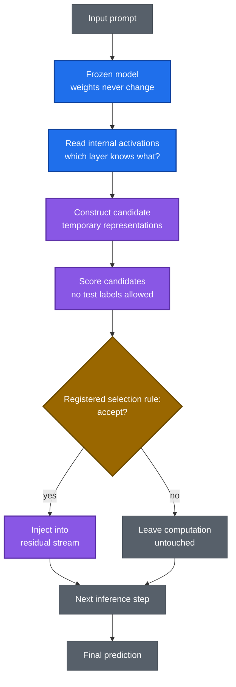
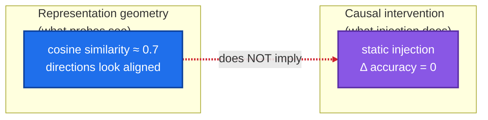
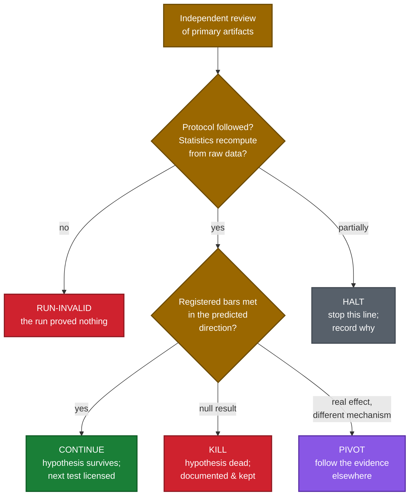
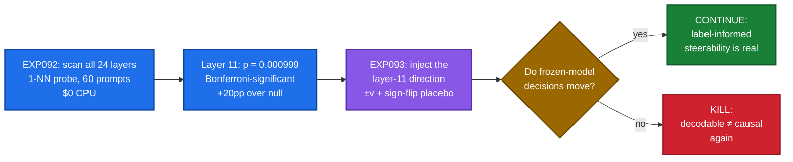

# Self-Consistent Basis Invention (SCBI)

**A falsification-first research program asking whether a frozen language model can become more cognitively capable through inference-time computation alone.**

- **Status:** active research · 70+ experiment runs · 251 research-log entries (as of 2026-09-25)
- **License:** Apache-2.0
- **Paper:** in preparation — boundary/negative-result workshop draft in `reports/paper_draft.md`

---

## 🧭 New here? Read this first (10 minutes)

If you just landed on this repository, follow this path. Everything below is explained in plain language — no prior context assumed.

| # | Do this | Time | Where |
|---|---------|------|-------|
| 1 | Read this README | 5 min | you are here |
| 2 | Skim the last 10 entries of the research log | 2 min | `reports/research_log.md` (tail) |
| 3 | Read the adopted program map | 3 min | `research/synthesis/` (REV2 synthesis) |
| 4 | Open one experiment run and read its report | — | `experiments/runs/EXP092_ibl/EXP092_RUN_REPORT_2026-09-25.md` |
| 5 | Check where we stand vs the field | — | `research/benchmarks/FRONTIER_SCOREBOARD.md` |

**The one-paragraph version:** We take a language model, *freeze its weights completely*, and ask: can it still do something smarter by thinking differently *during* inference — building temporary internal representations on the fly, without learning anything new? So far the honest answer is mostly "not the ways we've tried" — and each carefully documented "no" is the product. This repo is the lab notebook of that search: every hypothesis pre-registered, every result independently reviewed, every failure preserved.

---

## Why this bet matters — and why the industry should care

Training the biggest models is hitting walls:

- **Cost.** Frontier training runs cost hundreds of millions of dollars, roughly 10× per generation.
- **Data.** High-quality human text is finite; the field is approaching the data wall.
- **Time and energy.** Months of datacenter-scale compute per run.

Meanwhile a second scaling axis appeared: **inference-time compute**. Systems that "think longer" at inference gained real capability without any retraining. The bitter lesson keeps pointing the same way — methods that scale with compute win.

SCBI asks the extreme version of that question: **how much of intelligence is already inside frozen weights, unlockable by better inference-time computation alone?**

Formally, think of capability as $C(\theta, T)$ — $\theta$ the weights, $T$ the inference-time compute budget. The field has maximized $C$ by growing $\theta$ (ever-larger training). We fix $\theta = \theta_0$ and ask whether $\frac{\partial C}{\partial T} > 0$ in a *useful, general* way — not just longer chains of the same thought, but the model reorganizing its own representations mid-inference.

**If the answer is ever "yes, substantially":**
- 🔄 **Economics flip** — capability without retraining. Ship improvements as software, not as $100M training runs.
- 👤 **Personalization without fine-tuning** — adapt per user and per task, at inference time.
- 🔒 **Safety** — a frozen model is auditable; its weights are a fixed artifact you can inspect, not a moving target.
- 🔬 **Science** — we'd finally learn what trained models *contain* versus what they can *express*.

**If the answer is "no"** — and every result so far leans that way — that's boundary science with real value: it tells the industry where *not* to dig, and sharpens what training must actually provide. Either way, the answer is worth more than the cost of asking — and every test here costs $0.

**Honest ledger (2026-09-25):** 251 LOG entries, zero capability gains, one genuine boundary lead (0.7 cosine similarity with zero causal transfer, replicated). The bet is alive; the evidence is strict.

---

## What SCBI actually does

A normal LLM run is: prompt in → frozen weights compute → answer out. SCBI inserts a loop in the middle: at inference time, the model reads its own internal activations, constructs *candidate* temporary representations, scores them, and — only if a registered selection rule accepts — injects the winner back into its own computation. Nothing is ever learned; the weights never move. The bet is that *how* a frozen model routes information at inference time might be a source of capability that training alone doesn't capture.



Every box in that diagram is a falsifiable claim. Most of our experiments attack one box at a time: *is the information even there?* (localization), *does injecting it change anything?* (causality), *is the geometry we see the geometry that matters?* (mechanism).

---

## The canonical question

> **What discovery would have to be true for a frozen model to become far more cognitively capable through inference-time computation?**

Every experiment here is an attempt to answer that — or to kill a candidate answer as cheaply as possible. Our north-star aspiration is frozen models that think at a human level; that is the summit that organizes the work, **not a result**. No superhuman, conscious, or autonomous-capability claim is licensed anywhere in this repository.

## The frozen backbone

$$\boxed{\theta_t = \theta_0 \qquad \Delta\theta \equiv 0}$$

$\theta$ is every parameter of the model — weights, biases, normalization terms. $t$ indexes inference steps. The equation says: *nothing learns, ever.* This rules out fine-tuning, adapters, prompt-tuning that touches weights, and any "temporary" update that isn't perfectly reversed. Every run verifies it by hashing all parameters before and after; any mismatch makes the run RUN-INVALID — not a result, a voided run.

---

## The math, carefully

You don't need a PhD for this section — each object is given as **intuition first, then the formal bit**. These seven objects are everything our statistics rest on.

### 1. The intervention — $h' = h + \alpha v$

**Intuition:** we reach into the model's mid-thought activations and nudge them in a chosen direction, then watch whether its answer changes.

**Formal:** $h$ is the residual-stream vector at layer $l$, final token position (dimension 1024 for Pythia-410m). $v$ is a unit direction ($\lVert v\rVert = 1$) — e.g. the "task direction" found by EXP092. $\alpha$ is a scalar strength. The hooked forward pass computes with $h + \alpha v$ instead of $h$. The **placebo** is $-v$ (sign flip): if $+v$ "works" but $-v$ works equally well, the effect is generic perturbation, not information — the claim dies.

### 2. The probe — 1-NN leave-one-out (decodability)

**Intuition:** can a dumb nearest-neighbor classifier read the answer out of a layer's activations? If yes, the information is *present* there.

**Formal:** 60 items, each with a 1024-dim embedding and one of 20 labels. For each item, find the nearest of the other 59 by Euclidean distance, predict its label. Accuracy = correct / 60. Chance = 1/20 = **5%**. This measures *presence of information in the geometry* — it says nothing about whether the model uses it.

### 3. The permutation test — "could luck do this?"

**Intuition:** shuffle the labels randomly and re-score. If random labels score nearly as well, your "finding" is luck.

**Formal:** shuffle the 60 labels, recompute 1-NN accuracy; repeat ~1000× → the **null distribution** (what luck alone produces). $p$ = fraction of shuffles scoring ≥ the real accuracy. $q_{95}$ = 95th percentile of the null = the **luck ceiling**. **Effect** = accuracy − $q_{95}$ = how far above luck. Layer 11: 33.3% vs luck ceiling 13.3% → effect **+20pp**, $p = 0.000999$ (about 1 shuffle in 1000 beats it).

### 4. Bonferroni — "you took 24 shots"

**Intuition:** if you test 24 layers, one of them will look "significant" by accident. The bar must account for 24 chances.

**Formal:** family-wise threshold $0.05 / 24 \approx 0.00208$. A raw $p = 0.03$ on a single layer means nothing after 24 tries; layer 11's $p = 0.000999$ clears the corrected bar. Eight layers did.

### 5. Cosine similarity — "how aligned are two directions?"

**Intuition:** 1 = same direction, 0 = unrelated, −1 = opposite.

**Formal:** $\cos(u,v) = \frac{u \cdot v}{\lVert u\rVert\lVert v\rVert}$. Our cross-vocabulary concept directions scored ≈ **0.7** — visually "aligned" — and transferred exactly nothing under injection. The number that launched the dissociation finding.

### 6. The guards — "prove the apparatus worked"

**Intuition:** before believing any measurement, prove the injection did exactly what you asked — to a part per million. If not, the run is void, not negative.

**Formal (G5):** $\frac{\lVert r_{\text{hooked}} - (r_{\text{clean}} + \alpha v)\rVert}{\lVert \alpha v\rVert} \le 10^{-6}$. In words: after our hook runs, the residual must equal clean-plus-injection almost exactly. This guard caught the LOG-4349 hook-ordering bug — the probe measured the pre-injection state, the guard refused to bless it, and the run became RUN-INVALID instead of a false result. Guards are why our negatives are trustworthy.

### 7. The decision rule — "bars written before data"

Every experiment pre-registers numeric bars (e.g. *"CONTINUE iff some layer $l \ne 20$ has Bonferroni-significant $p_l$ AND effect ≥ 10pp"*). The verdict is then mechanical — no human judgment at the moment of truth. That's what makes a KILL a fact rather than an opinion.

---

## Core concepts, explained

### 1. Decodability ≠ causality (the dissociation)

The single most important idea in the repository, and the source of most of our results.



A *probe* can read information out of a layer (decodability). That does **not** mean the model *uses* that information when deciding (causality). EXP065/EXP066 found ~0.7 cross-vocabulary cosine similarity that transferred exactly nothing under static injection. EXP092 found task information decodable at layer 11 — EXP093 exists solely to test whether injecting it *moves decisions*. Confusing these two is the field's most common error; our review process treats it as a blocking defect.

### 2. The launch chain (how an experiment earns the right to run)

No experiment runs on a hunch. Every run passes through this pipeline, and skipping a step invalidates it:


**Pre-registration** means the question, the exact decision rule, the statistical bars, and the compute budget are written down *before* execution — so we can't move the goalposts after seeing data. **Law #14** is our independent reviewer: it reports to the founder, not to the lab's CEO, its verdicts are binding, and it recomputes statistics from primary artifacts. Twice it has caught degenerate mathematics before a single flop was spent.

### 3. How a verdict is decided



A KILL is a success here, not a failure — it permanently closes a wrong path and costs the field nothing to re-discover. Retractions are documented in-paper, never buried.

### 4. The localization → causality two-step (our current frontier)

Our most productive pattern: first find *where* information lives (cheap, correlational), then test *whether it matters* (causal, decisive).



EXP093's registered prior is openly pessimistic — the per-item correction directions are only ~3% coherent, so KILL is the expected outcome. We pre-registered it anyway, because a surprising CONTINUE would be extremely informative. That's what "falsification-first" means in practice. (First execution attempt: RUN-INVALID at LOG-4349 — the G5 guard caught a hook-ordering bug in the bundle's own probe before any measurement. Repair lane running; the question stays open.)

---

## What we have established

Licensed findings — each survived independent adversarial review. Numbers quoted exactly as logged; primary artifacts in `experiments/runs/`.

### Finding 1: The representational–causal dissociation (EXP065 / EXP066)

Raw cross-vocabulary geometric similarity of **~0.7 cosine** does **not** yield causal transfer under static injection. The similarity is real and measurable; it does not move decisions. Replicated across Pythia scale (160M → 410M) with Δθ ≡ 0 strictly verified. **Decodability is not influence.**

### Finding 2: The concept geometry is not where the leverage is (EXP077)

Four static geometric variants of a concept direction (cone at multiple angles, cone-vs-line, cone-vs-control, offset, radial grid) moved decision accuracy by exactly **Δ = 0 (p = 1.0)** — branch (c) NEITHER. The output-side bridge positive control rescued **+10pp (56.67% → 66.67%, p = 0.03125)**. Licensed reading: the transferable direction lives output-side, not in the concept geometry. The unconditional 30° cone and α = 1 offset hypotheses are dead at Pythia-410m/layer 20; gated and conditional variants survive.

### Finding 3: Task information localizes to mid-network layers (EXP092) — CONTINUE

Information-bottleneck scan across all 24 layers of frozen Pythia-410m (60 prompts, 60 forward passes, $0 CPU). Leave-one-out 1-NN accuracy per layer, 20 labels (5% chance):

```
L00 ████████████         23.3%
L01 █████████████        26.7% ★
L02 ████████████         23.3%
L03 ██████████           20.0%
L04 ██████████           20.0%
L05 ███████              13.3%
L06 ███████              13.3%
L07 ██████               11.7%
L08 ███████              13.3%
L09 ██████               11.7%
L10 ███████              13.3%
L11 █████████████████    33.3% ★  ← peak, p = 0.000999, +20pp over null q95
L12 ████████████████     31.7% ★
L13 ███████████████      30.0% ★
L14 █████████████        26.7% ★
L15 ████████████         23.3% ★
L16 ███████              13.3%
L17 ██████████████       28.3% ★
L18 █████████████        26.7% ★
L19 ████████             16.7%
L20 ████████             15.0%  (previously inspected layer — correctly excluded)
L21 ████████             16.7%
L22 ████████             16.7%
L23 ████████             15.0%

★ = Bonferroni-significant AND ≥10pp above null q95 → {1, 11, 12, 13, 14, 15, 17, 18}
```

A broad mid-network elevation (layers 11–18: 23–33%) against a near-chance background elsewhere (12–17%). Layer 20 — the layer previous work inspected — sits at 15%, p ≈ 0.066: not significant. The independent reviewer recomputed every statistic from the primary embeddings and agreed exactly.

**Licensed claim:** *frozen Pythia-410m layer 11 carries significant task information on the EXP092-B bench.* **Caveat (registered):** the signal is phrasing-sensitive (A-first 53.3% vs C-first 13.3%) — any "redirect to layer 11" claim carries that caveat. And this is *decodability*; causality is EXP093's job.

### Finding 4: Falsified mechanism candidates

- **EXP091 — KILL.** Zero-shot cosine-similarity scoring of frozen layer-20 final-token embeddings on a registered novel relational benchmark: **31/60 = 51.67%, p = 0.449**. No exploitable decision signal at layer 20.
- **G1 (QK/OV projection-energy audit) — KILL.** The "Core Causal Null-Space Theorem" is false as a QK-subspace claim: the failed direction is unusually QK-visible while the working bridge is QK-unremarkable — the exact inversion of the theorem's central sentence.
- **K1 (readout-tilt falsification)** — the tilt charge did not hold (0 of 180 reached the 0.9 bar).

### Finding 5: Novelty position — N1 (Known Combination)

The adopted program synthesis rates our novelty as **N1**: the tested static mechanism is operator-equivalent to prior art (the CAA family). We claim one genuine lead — **boundary science**: 0.7 cosine similarity with zero causal transfer, replicated, retraction on record — and zero capability entries. Beating the industry frontier needs powered N≈100+ evidence, roughly an order of magnitude more than anything produced to date. That gap is tracked openly on the scoreboard, not hidden.

### In flight

- **EXP093 (layer-11 causal transfer)** — the causal counterpart to EXP092's correlational result. First execution attempt returned RUN-INVALID (LOG-4349): the G5 guard caught a hook-ordering defect in the bundle's own verification probe before any measurement — the hypothesis was never tested. Repair lane running, then independent re-verification, then re-execution (~15 CPU-min, $0).

---

## What we do NOT claim

Honesty about negatives is this program's core asset. The following are explicitly **not** established and are policed by review:

- **No capability claim.** Nothing here shows a frozen model reasoning better, let alone approaching human-level or superhuman cognition.
- **Decodability ≠ causality.** A probe that reads information out of a layer (EXP092) does not show the model *uses* that information (that's what EXP093 tests).
- **Bridge positives are rescue artifacts.** The output-side bridge that rescues accuracy is a *known-answer direction* — a positive control, not evidence of an autonomous mechanism (standing CEO ruling, LOG-204).
- **Nulls are first-class citizens.** Every kill, halt, retraction, and RUN-INVALID is preserved, logged, and plotted on the frontier scoreboard.

---

## Repository map

```text
SCBI/
├── theory/                  # Definitions, assumptions, formulation, algorithm,
│                            # complexity, proofs — the mathematical specification
│   ├── README_DEFINITIONS.md # Canonical vocabulary (Law #5: changes need a changelog)
│   ├── README.md             # Mathematical specification
│   └── proofs/               # Procrustes-failure proof et al.
├── research/
│   ├── CAMPAIGN_30DAY.md     # Current autonomous campaign charter (lanes, cadence)
│   ├── GIT_WORKFLOW.md       # Lab git SOP: branches, PRs, review-before-merge
│   ├── CEO_DIARY.md          # Institutional memory of the research program
│   ├── benchmarks/           # Frontier scoreboard: SCBI vs 6 industry
│   │                         # inference-time systems (updated per verdict)
│   └── synthesis/            # A–J and REV2 program syntheses (adopted)
├── experiments/
│   ├── protocols/            # Pre-registrations: DRAFT → Law #14 review → SIGNED
│   │   ├── REVIEWS/          # Independent review verdicts (binding)
│   │   └── *_SIGNED.md       # Immutable once signed (corrections via errata only)
│   └── runs/                # 70+ run directories: bundle + report + artifacts
├── evaluation/              # Metrics, statistical tests, ablations, failure analysis
├── reports/
│   ├── research_log.md      # The chronological record: 251 LOG entries — every
│   │                        # verdict, kill, halt, and retraction preserved
│   ├── paper_draft.md       # Boundary/negative-result workshop paper (~5k words)
│   └── mentor_adoption_gate_rev2_2026-09-23.md
├── scbi/                    # Implementation: frozen-backbone runtime, guards
├── scripts/                 # Tooling
├── documentation/           # Additional documentation
├── TECHNICAL_STACK.md       # Compute setup: free-tier GPU lanes (Kaggle/Colab),
│                            # CPU-first $0 execution, reproducibility requirements
├── MUSE_HANDOVER_PROMPT.md  # Machine-readable program handover
└── AGENTS.md                # Behavioral constitution: the 14 agent laws
```

### Source-of-truth hierarchy

When documents disagree: `theory/README_DEFINITIONS.md` → `theory/README.md` → `theory/README_ASSUMPTIONS.md` → `research/README_LITERATURE.md` → `theory/README_ALGORITHM.md` → `scbi/README.md` → `experiments/README.md` → `evaluation/README.md` → `reports/README.md`. Primary artifacts outrank summaries; the research log outranks this README.

---

## Experiment registry (selected)

| Experiment | Question | Verdict |
|---|---|---|
| EXP065/066 | Does ~0.7 cross-vocab similarity transfer causally? | Boundary: similarity without transfer |
| EXP077 | Does any static geometric variant move decisions? | (c) NEITHER; bridge rescues +10pp |
| EXP079 | HALT probe for the adaptive loop | HALT accepted via CPU readiness |
| EXP082 | Foil-suppression tilt | KILL upheld |
| EXP083/084 | Relational amplification; Newton-vs-gradient duel | Signed, queued for GPU |
| EXP086 | Dynamical amplifier (attention non-normality) | Stage A advisory (He ≈ 0.73–0.83, None by construction); Stage B signed, queued for GPU |
| EXP087 | Translation signature | Bundle repaired, CEO-cleared for GPU |
| EXP088 | Recirculation | Queued for GPU |
| EXP089/090 | CLM-8B adaptation | Superseded / RUN-INVALID (tokenization) |
| EXP091 | Layer-20 cosine readout | KILL (31/60, p = 0.449) |
| EXP092 | Information-bottleneck localization | CONTINUE (layer 11, p = 0.000999) |
| EXP093 | Layer-11 causal transfer | RUN-INVALID at first execution (G5 probe defect); repair lane running |
| K2 | Routing-contrast bypass | First in GPU queue |
| G1 | QK null-space mechanism | KILL (theorem false as stated) |

The full record — every LOG entry, kill, halt, and retraction — is in `reports/research_log.md`.

---

## Reproducing results

**CPU-first, $0.** Most of the program's decisive results (EXP091, EXP092, G1, K1) ran on CPU with read-only weight access. Each run directory contains its bundle, build notes, and run report; guards (bench pins, weight hashes, thread pins) are asserted at execution time.

**GPU queue.** GPU experiments run on user-owned free-tier hardware (Kaggle/Colab), never on lab infrastructure. Current order: **K2 → EXP083 → EXP084 → EXP086 Stage B → EXP088**. Each has a tested execution bundle and an independent SIGN; execution notebooks live in the run directories (e.g. `experiments/runs/K2_routing_bypass/K2_kaggle_run.ipynb`).

**Reproducibility standard:** pinned seeds, environment manifests, pre/post parameter hashes (Δθ = 0 asserted), raw instance logs preserved. A run that cannot reproduce its guard values is RUN-INVALID, not a result.

---

## Glossary

For the visiting researcher — the terms we use constantly, defined once:

| Term | Meaning |
|---|---|
| **Frozen backbone** | The model's weights never change during an experiment (Δθ ≡ 0, hash-verified). The defining constraint of the program. |
| **Pre-registration** | The question, decision tree, statistical bars, and budget written down *before* execution. Prevents moving goalposts. |
| **Signed protocol** | A pre-registration that passed independent review. Immutable — corrections happen via append-only errata or a new experiment number. |
| **Law #14** | The independent reviewer role: reports to the founder, verdicts are binding, recomputes stats from primary artifacts. |
| **LOG-n** | Numbered entries in `reports/research_log.md` — the chronological, append-only record of everything. |
| **Bench** | A registered task+dataset+metric triple an experiment runs against (e.g. EXP092-B). |
| **Guard** | A machine-checked invariant asserted at runtime (weight hashes, thread pins, bench pins). A failed guard invalidates the run. |
| **Bridge** | A known-answer direction used as a *positive control* — it rescues accuracy by construction and proves the injection machinery works. Not evidence of a discovered mechanism. |
| **Decodability** | A probe can read information out of activations. Correlational; does not imply the model uses it. |
| **Causality** | Injecting a direction *moves* the frozen model's decisions. The bar that matters. |
| **KILL / CONTINUE / PIVOT / HALT / RUN-INVALID** | The five experiment verdicts (see diagram above). |
| **SIGN / SIGN-WITH-FIXES / REJECT** | The three protocol-review verdicts. |
| **Errata** | Append-only corrections to signed protocols. The original is never edited. |
| **Null** | A negative result. First-class output of the program, preserved and plotted. |

---

## FAQ

**Why are there so many KILLs?**
Because the program is designed to kill. Every candidate passes the worth-it gate (Law #15): a precise question, the KILL/CONTINUE/PIVOT decision it changes, and the cheapest falsifying test. A fast, cheap, well-documented kill is worth more than an expensive ambiguous maybe.

**Can I reproduce your results?**
Yes — that's the point of the run directories. Most decisive results are CPU, $0, with pinned seeds and hash-verified frozen weights. Start with `experiments/runs/EXP092_ibl/` (localization) and read its run report.

**Is this claiming progress toward AGI or machine consciousness?**
No. The summit — frozen models thinking at a human level — is the aspiration that organizes the research. Every licensed claim in this repo is narrower: localization, boundary results, falsified mechanisms. Anything broader is explicitly marked as not established.

**Why is the GPU queue "waiting"?**
GPU experiments run on the founder's own free-tier hardware (Kaggle/Colab). Bundles are built, tested, and independently signed; execution happens when the founder runs the notebooks. We never spend money on compute.

**How do I know you didn't cherry-pick?**
Three mechanisms: (1) pre-registration with registered decision trees, (2) an independent reviewer that recomputes statistics from primary artifacts and can kill a result, (3) an append-only log where kills, halts, and retractions are preserved — including our own retracted claims.

**What's the math I need to follow this?**
The "math, carefully" section above covers all of it: the frozen constraint, the intervention, the probe, permutation tests, Bonferroni, cosine similarity, and the guards. High-school statistics plus basic linear algebra is enough.

**Where should I contribute?**
See [Contributing](#contributing-lab-workflow) below — topic branches, PRs for everything, review before merge.

---

## How the lab works

This repository is run as a continuous research program, not a collection of scripts.

**Independent review with teeth.** The Independent Scientific Mentor / Adversarial Reviewer reports to the founder, not to the lab's CEO. Its verdicts are binding and cannot be overridden or suppressed. Reviews recompute statistics from primary artifacts — twice this program's reviewers have caught degenerate mathematics before a single flop was spent.

**The 14 agent laws** (full text in `AGENTS.md`): read before modifying; never invent results; never fabricate citations; never silently shift hypotheses or definitions; preserve the frozen backbone; zero data leakage; never delete failed experiments; no post-hoc metric cherry-picking; never claim premature novelty; distinguish observation from interpretation; document major decisions; preserve reproducibility; challenge rather than defend.

**Every cycle passes the worth-it gate** (Law #15): precise question → the KILL/CONTINUE/PIVOT decision it changes → the cheapest falsifying test and its cost → the mathematical license with a quantitative prediction and a breaking point. No license, no work.

**Signed protocols are immutable.** Corrections happen through append-only errata or a new experiment number — never silent edits, never force-pushes.

---

## Contributing (lab workflow)

This repo follows lab discipline (`research/GIT_WORKFLOW.md`):

- **Topic branches** per workstream (`exp/093-…`, `review/…`, `docs/…`) — nobody commits to `main` directly
- **Pull requests for everything**, with LOG-linked descriptions and test evidence
- **Review before merge** — research artifacts need an independent Law #14 SIGN
- **Push constantly**; never force-push; never commit secrets, credentials, or model weights

---

## License

Apache-2.0 — see `LICENSE`.

## Citation

Paper in preparation. Until publication, cite the repository and the research log:

> SCBI Research Program, *Self-Consistent Basis Invention: boundary science for frozen-model inference-time computation*, GitHub repository, 2026. Experimental record: `reports/research_log.md`.
