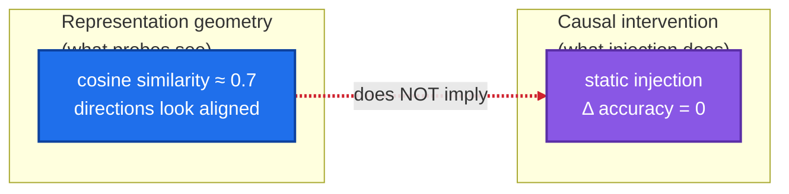
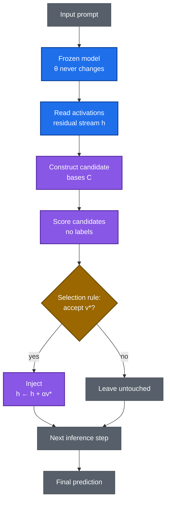

# Self-Consistent Basis Invention (SCBI)

**The research program to give frozen language models the power to think — new cognitive capability from inference-time computation alone, without ever changing a weight.**

---

## The vision — what this research is going to achieve

Today, making a model smarter means retraining it: hundreds of millions of dollars, months of compute, a data wall approaching. SCBI pursues a different future — one where **capability ships as software, not as training runs**.

The goal is a frozen foundation model that improves its own cognition at inference time: it reads its internal activations, *invents* temporary task-specific representations, evaluates them, and selects the best — all with its weights permanently frozen. Concretely, the program is built to deliver:

1. **Inference-time representation synthesis** — models that construct useful internal representations on the fly, per prompt, per task.
2. **Proven causal control** — directions in activation space that reliably *steer* frozen-model decisions, not merely decode from them.
3. **The capability equation** — a quantitative map of how much intelligence is latent in frozen weights versus how much must come from training: $\frac{\partial C}{\partial T}$ at fixed $\theta$.
4. **A new deployment paradigm** — reasoning upgrades deployed instantly, personalization without fine-tuning, and models whose frozen weights remain fully auditable.

This is the summit the entire program climbs toward: **frozen models that think at a human level.**

---

## The problem

Frontier AI scales by growing $\theta$ — ever-larger training. That road is narrowing:

- **Cost.** Frontier runs cost hundreds of millions of dollars, ~10× per generation.
- **Data.** High-quality human text is finite.
- **Energy and time.** Months of datacenter-scale compute per run.

Meanwhile, a second scaling axis has appeared: **inference-time compute**. Systems that think longer at inference gained real capability with zero retraining. The bitter lesson keeps pointing the same way — methods that scale with compute win. SCBI asks the extreme form of that question: *how far can inference-time computation alone take a frozen model?*

---

## The research question

> **What discovery would have to be true for a frozen model to become far more cognitively capable through inference-time computation?**

Formally: let capability be $C(\theta, T)$ — $\theta$ the weights, $T$ the inference-time compute budget. The field maximizes $C$ by growing $\theta$. We fix $\theta = \theta_0$ and ask whether $\frac{\partial C}{\partial T} > 0$ in a *useful, general* way — not longer chains of the same thought, but the model reorganizing its own representations mid-inference.

---

## Theoretical framework

### 1. Frozen inference

$$\boxed{\theta_t = \theta_0 \qquad \Delta\theta \equiv 0}$$

$\theta$ is every parameter — weights, biases, normalization terms; $t$ indexes inference steps. Nothing learns, ever. This is the defining constraint: it rules out fine-tuning, adapters, and any "temporary" update that isn't perfectly reversed. Every experiment enforces it with pre/post parameter hashes.

### 2. The representation space

At layer $l$, the model's working memory is the **residual stream** $h \in \mathbb{R}^d$ ($d = 1024$ for Pythia-410m) at each token position. Everything the model "knows" mid-computation lives in these vectors. SCBI operates here — not on weights, not on tokens, but on the geometry of thought itself.

### 3. The intervention operator

$$h' = h + \alpha v, \qquad \lVert v \rVert = 1$$

**Intuition:** reach into the model's mid-thought activations and nudge them along a chosen direction $v$ with strength $\alpha$, then observe whether its decision changes.

**The placebo that makes it science:** $-v$ (sign flip). If $+v$ "works" but $-v$ works equally well, the effect is generic perturbation, not information — the claim dies. Every causal test in this program runs against its own sign-flipped control.

### 4. Decodability ≠ causality

The central distinction of the program:



A **probe** reads information out of activations (decodability — correlational). An **intervention** moves the model's decisions (causality — the bar that matters). Established result: ~0.7 cross-vocabulary cosine similarity with exactly zero causal transfer under static injection. Confusing the two is the field's most common error.

### 5. The selection problem — the heart of "basis invention"

Finding a direction $v$ is easy; finding it *without labels, at inference time, per prompt* is the research. The model must propose candidate bases, score them with label-free criteria, and select — inventing the right coordinate system for each thought. This is what separates SCBI from steering-vector methods that hand the model a precomputed direction.

### 6. Statistical certification — how we know a result is real

- **Probe:** 1-nearest-neighbor leave-one-out over 60 items / 20 labels (chance = 5%). Measures whether label information is *present* in a layer's geometry.
- **Permutation test:** shuffle labels ~1000× → null distribution. $p$ = fraction of shuffles beating the real score; $q_{95}$ = luck ceiling; **effect** = accuracy − $q_{95}$.
- **Bonferroni:** testing 24 layers means 24 chances to get lucky — the bar is $0.05/24 \approx 0.00208$.
- **Guards:** machine-checked validity, e.g. injection fidelity $\frac{\lVert r_{\text{hooked}} - (r_{\text{clean}} + \alpha v)\rVert}{\lVert \alpha v\rVert} \le 10^{-6}$. A failed guard voids the run (RUN-INVALID) — it never becomes a false result.
- **Pre-registered decision rules:** numeric bars written before execution (KILL / CONTINUE / PIVOT), so verdicts are mechanical, not judgment calls.

---

## The algorithm

The SCBI inference loop — the artifact the whole program is trying to bring into existence:

```text
SCBI-Inference(prompt x, frozen model M_θ, budget T):
    h ← M_θ.encode(x)                      # frozen forward pass, θ untouched
    repeat T times:
        C ← ConstructCandidates(h)         # propose temporary bases
        s ← Score(C)                       # label-free scoring
        v* ← Select(C, s)                  # registered selection rule
        if Accept(v*):
            h ← h + αv*                    # inject into residual stream
    return M_θ.decode(h)                   # final prediction
```



Each box is a research problem: *ConstructCandidates* (how to propose bases), *Score* (label-free evaluation), *Select* (the decision rule), *Inject* (causal delivery). The program attacks them in order — localization first, then causality, then mechanism, then autonomy.

---

## Benchmarks — how progress is measured

The program's evaluation suite, each bench a registered task + dataset + metric:

| Bench | What it measures | Method |
|---|---|---|
| **Localization** | Where task information lives in the frozen model | 1-NN LOO probe across all layers; permutation test + Bonferroni |
| **Causal transfer** | Whether an injected direction moves decisions | $\pm v$ intervention with sign-flip placebo; decision-accuracy delta |
| **Geometry** | Which geometric hypotheses transfer | Cones, offsets, radial grids, relational directions vs controls |
| **Guards** | Whether the apparatus worked | Δθ = 0 hashes, injection fidelity ≤ 10⁻⁶, bench pins |
| **Frontier scoreboard** | SCBI vs the field | Tracked against 6 industry inference-time systems (`research/benchmarks/`) |

Every bench runs CPU-first at $0; GPU benches execute on free-tier hardware with tested, independently signed bundles.

---

## Scientific foundations

Results the program has established — the ground the roadmap builds on:

- **The representational–causal dissociation.** ~0.7 cross-vocabulary cosine similarity yields zero causal transfer under static injection, replicated across Pythia scale (160M → 410M). Decodability is not influence.
- **Mid-network localization.** Task information in frozen Pythia-410m peaks at layer 11: 33.3% 1-NN accuracy vs 5% chance, $p = 0.000999$ (Bonferroni-significant), +20pp above the null ceiling — with the previously inspected layer 20 correctly excluded at 15%.
- **Falsified paths.** Layer-20 readouts carry no signal; static cone geometry moves nothing; the QK null-space mechanism is false as stated. Each is preserved as a permanent "do not dig here."

## Research roadmap

- **Phase 1 — Localization.** Map where task information lives in frozen models. *(Established: layer-11 peak.)*
- **Phase 2 — Causality.** Prove injected directions move frozen-model decisions. *(The decisive test.)*
- **Phase 3 — Mechanism.** Characterize which geometries transfer and why — the transfer operator.
- **Phase 4 — Autonomy.** The model invents its own bases at inference time, per prompt, without labels. **The summit.**

---

## Repository map

```text
SCBI/
├── theory/                  # Definitions, assumptions, formulation, proofs
├── research/
│   ├── benchmarks/           # Frontier scoreboard: SCBI vs industry systems
│   ├── synthesis/            # Adopted program syntheses (REV2)
│   ├── GIT_WORKFLOW.md       # Lab git discipline
│   └── CAMPAIGN_30DAY.md     # Campaign charter
├── experiments/
│   ├── protocols/            # Pre-registrations (DRAFT → reviewed → SIGNED, immutable)
│   │   └── REVIEWS/          # Independent review verdicts (binding)
│   └── runs/                # 70+ run directories: bundle + report + artifacts
├── evaluation/              # Metrics, statistical tests, ablations
├── reports/
│   ├── research_log.md      # Append-only chronological record (every verdict preserved)
│   └── paper_draft.md       # Boundary/negative-result workshop paper
├── scbi/                    # Implementation: frozen-backbone runtime, guards
├── TECHNICAL_STACK.md       # Free-tier compute setup, reproducibility standard
└── AGENTS.md                # The 14 agent laws (behavioral constitution)
```

**Source-of-truth hierarchy:** `theory/README_DEFINITIONS.md` → `theory/README.md` → `theory/README_ASSUMPTIONS.md` → `research/README_LITERATURE.md` → `theory/README_ALGORITHM.md` → `scbi/README.md` → `experiments/README.md` → `evaluation/README.md` → `reports/README.md`. Primary artifacts outrank summaries.

---

## Glossary

| Term | Meaning |
|---|---|
| **Frozen backbone** | Weights never change (Δθ ≡ 0, hash-verified). The defining constraint. |
| **Residual stream** | The model's working memory: vectors $h \in \mathbb{R}^d$ at each layer and token. Where SCBI operates. |
| **Intervention** | $h' = h + \alpha v$: injecting a direction into activations mid-forward-pass. |
| **Placebo** | The sign-flipped direction $-v$; controls for generic perturbation effects. |
| **Decodability** | A probe reads information from activations. Correlational. |
| **Causality** | An intervention moves the model's decisions. The bar that matters. |
| **Pre-registration** | Question, decision tree, bars, and budget written *before* execution. |
| **Signed protocol** | Reviewed and immutable pre-registration; corrections via append-only errata. |
| **Guard** | Machine-checked invariant (weight hashes, injection fidelity). Failed guard = void run. |
| **Bridge** | Known-answer positive control proving the injection machinery works. |
| **KILL / CONTINUE / PIVOT / HALT / RUN-INVALID** | The five verdicts. A KILL is a result, not a failure. |

---

## Reproducing

CPU-first, $0$: pinned seeds, environment manifests, pre/post parameter hashes, raw instance logs. Each run directory is self-contained (bundle + build notes + report). GPU benches run on free-tier hardware via tested notebooks.

## Contributing

Lab discipline (`research/GIT_WORKFLOW.md`): topic branches, PRs for everything, review before merge, never force-push, never commit secrets or weights.

## License

Apache-2.0 — see `LICENSE`.

## Citation

> SCBI Research Program, *Self-Consistent Basis Invention: inference-time intelligence in frozen models*, GitHub repository, 2026.
